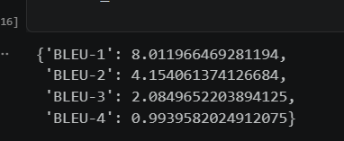
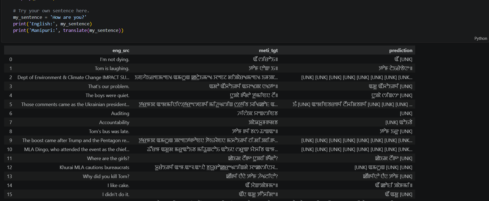

This is a basic implementation of Encoder-Decoder Model for translation of English to Manipuri.
It doesn't uses any pre-trained model it uses a dataset which has three columns :
English Statement
Manipuri Translation in Manipuri script
Manipuri Translation in Latin Script

THis is not a advance model this was made for the sole purpose of how to implement Encoder-decoder Model

These are the result

